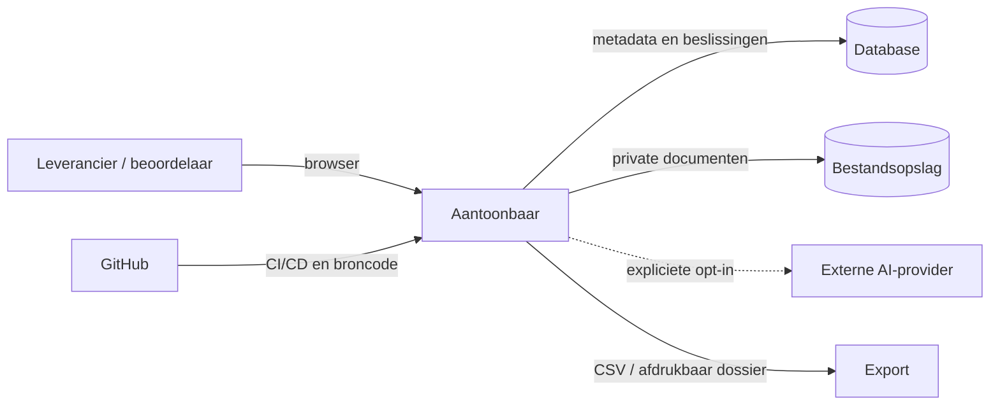
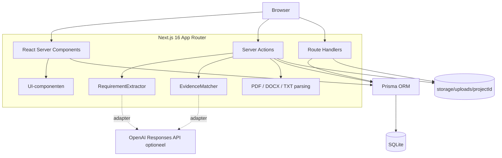
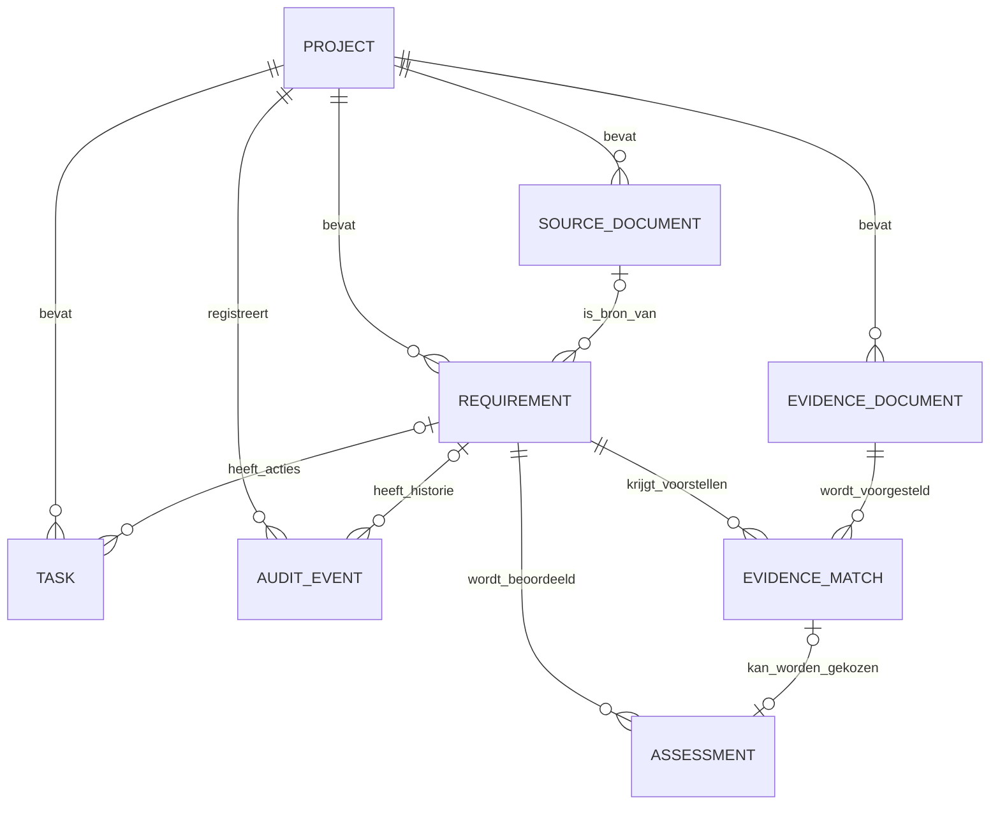
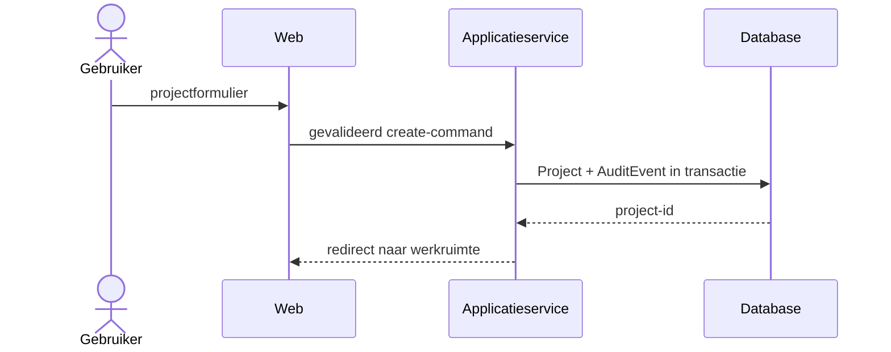
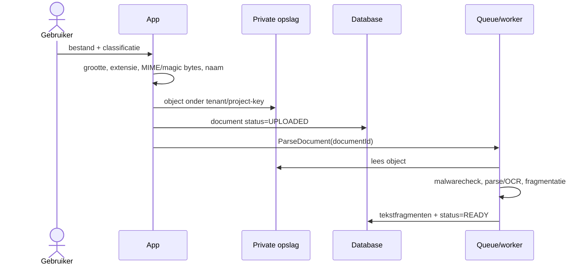
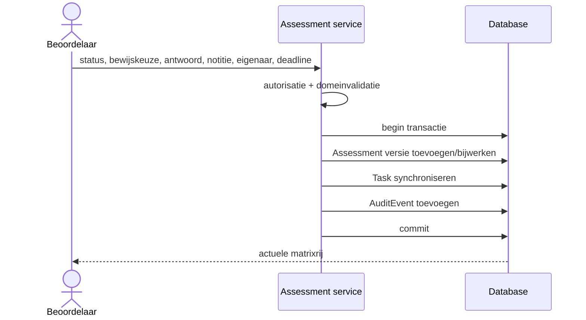
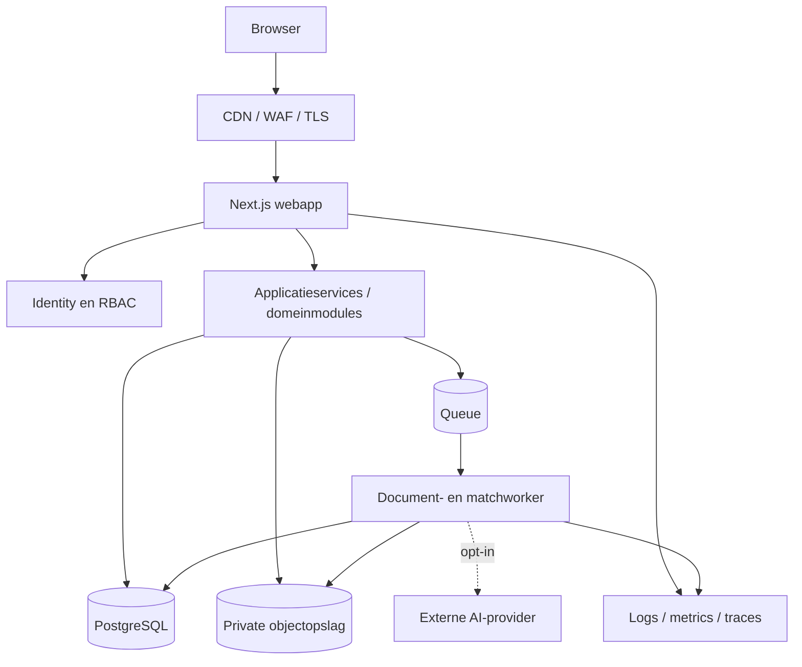

# Architectuurblauwdruk Aantoonbaar

Status: leidend technisch ontwerp voor de huidige MVP en de doorgroei naar productie  
Versie: 1.0  
Laatst bijgewerkt: 22 september 2026

## 1. Doel van dit document

Dit document legt de samenhang van Aantoonbaar vast: het productdomein, de softwarecomponenten, gegevensstromen, opslag, beveiligingsgrenzen, tests, deployment en het groeipad naar een productieplatform. Het voorkomt dat de MVP ongemerkt de definitieve architectuur wordt.

De blauwdruk maakt steeds onderscheid tussen:

- **Huidige MVP**: wat aantoonbaar in deze repository werkt;
- **Domeinregel**: gedrag dat bij iedere technische implementatie behouden moet blijven;
- **Doelarchitectuur**: de aanbevolen vorm voor een beveiligde, multi-user productieomgeving.

## 2. Productgrens en kernbelofte

Aantoonbaar ondersteunt Nederlandse IT- en AI-leveranciers bij het verzamelen, herleiden en menselijk beoordelen van bewijs voor eisen uit aanbestedingen en klantuitvragen.

De applicatie doet wel:

- documenten innemen en tekst extraheren;
- concept-eisen herkennen met een traceerbare bron;
- mogelijke bewijsrelaties voorstellen;
- inconsistenties, hiaten en verlopen bewijs signaleren;
- menselijke beoordelingen en acties vastleggen;
- een controleerbare eisen-bewijsmatrix exporteren.

De applicatie doet nadrukkelijk niet:

- juridisch vaststellen dat een organisatie compliant is;
- certificeren of goedkeuren;
- zonder menselijke controle een definitief oordeel geven;
- normteksten vervangen of de interpretatie van een jurist, auditor of inkoper overnemen.

De vaste disclaimer is daarom een domeinonderdeel, geen vrijblijvende UI-tekst:

> Aantoonbaar ondersteunt de voorbereiding en beoordeling van bewijsdossiers. Een voorgestelde koppeling is geen juridisch oordeel, certificering of garantie van naleving.

## 3. Architectuurprincipes

1. **Mens beslist, automatisering adviseert.** Extractie en matching leveren voorstellen; alleen een mens bepaalt de beoordelingsstatus.
2. **Herleidbaarheid boven slimheid.** Iedere eis en match moet terug te voeren zijn op document, locatie en letterlijk fragment.
3. **Brondata blijft onveranderd.** Een afgeleide titel, categorie of samenvatting vervangt nooit het oorspronkelijke fragment.
4. **Privacy standaard lokaal en minimaal.** Zonder expliciete AI-configuratie verlaat documentinhoud de lokale omgeving niet.
5. **Poorten en adapters.** Extractors, matchers, opslag en AI-providers zijn verwisselbaar achter kleine interfaces.
6. **Modulaire monoliet vóór microservices.** Domeinen worden logisch gescheiden, maar blijven één deploybare applicatie tot schaal of risicoscheiding iets anders vereist.
7. **Asynchroon waar verwerking zwaar is.** Uploaden mag snel bevestigen; parsing, OCR, extractie en matching worden in productie achtergrondtaken.
8. **Tenantgrenzen in iedere query.** Een object wordt nooit alleen op id opgehaald als project- of organisatiecontext beschikbaar is.
9. **Audit is append-only.** Een historische gebeurtenis wordt niet stil gewijzigd of verwijderd.
10. **Veilig falen.** Een mislukte AI-call valt terug op lokale verwerking, maar de gekozen engine en foutstatus blijven zichtbaar.

## 4. Systeemcontext



Vertrouwensgrenzen:

- **Gebruikersgrens**: authenticatie, sessie, autorisatie en invoervalidatie;
- **Applicatiegrens**: domeinregels en project-/tenantisolatie;
- **Opslaggrens**: database en private objecten mogen niet rechtstreeks publiek zijn;
- **Providergrens**: externe AI ontvangt alleen data na bewuste configuratie en beleidstoets;
- **Exportgrens**: een export kan vertrouwelijke inhoud bevatten en moet als zodanig worden behandeld.

## 5. Huidige runtime-architectuur

De MVP is een server-side Next.js-applicatie met een dunne browserlaag. Mutaties lopen via Server Actions; downloads en CSV-export via Route Handlers.



### Technische stack

| Laag | Huidige keuze | Verantwoordelijkheid |
|---|---|---|
| Web | Next.js 16, React 19, App Router | pagina's, Server Components, Server Actions en API-routes |
| Taal | TypeScript | types en applicatielogica |
| Styling | Tailwind CSS 4 | responsive zakelijke interface |
| Data | Prisma 6 | schema en databasequeries |
| Database | SQLite | lokale relationele opslag |
| Bestanden | lokale private map | uploads buiten `public/` |
| Extractie | lokale parsers + heuristiek | tekst en eisen herkennen |
| Matching | lokale overlap-/regelmatcher | bewijsvoorstellen berekenen |
| Optionele AI | OpenAI Responses API-adapters | alternatieve extractie en matching |
| Tests | Vitest en Playwright | domein-, integratie- en browsercontrole |

## 6. Logische modules

De bestaande code is nog compact. De bedoelde grenzen zijn:

| Module | Verantwoordelijkheid | Belangrijkste data |
|---|---|---|
| Portfolio | dossiers tonen en aanmaken | `Project` |
| Intake | bronbestanden valideren, opslaan en parsen | `SourceDocument` |
| Requirements | eisen extraheren en redigeren zonder bronverlies | `Requirement` |
| Evidence | bewijs registreren, scope en geldigheid beheren | `EvidenceDocument` |
| Matching | alleen voorstelrelaties genereren | `EvidenceMatch` |
| Assessment | menselijke beoordeling en goedkeuring | `Assessment` |
| Work management | eigenaar, deadline en openstaande actie | `Task` |
| Audit | wijzigingen append-only vastleggen | `AuditEvent` |
| Reporting | dashboard, CSV en dossierweergave | read models over meerdere modules |
| Identity, toekomstig | organisatie, gebruiker, rollen en sessies | `Organization`, `User`, `Membership` |
| Ownership, toekomstig | beheerder koppelt per inhoudelijk domein de bevoegde eigenaar | `OrganizationDomain`, `DomainOwnership` |

Gewenste code-indeling bij verdere groei:

```text
app/                    routes, layouts, actions en route handlers
components/             presentatielaag; geen databasequeries
modules/
  projects/             domeinservice, queries, validators
  documents/            upload-, opslag- en parsepoorten
  requirements/         extractiepoort en domeinregels
  evidence/             evidence lifecycle en geldigheid
  matching/             matchpoort, scoring en waarschuwingen
  assessments/          menselijke besluitvorming
  audit/                auditservice
  reporting/            dashboards en exports
infrastructure/
  database/             Prisma-repositories
  storage/              local en object-storage adapters
  ai/                   lokale en externe AI-adapters
  queue/                achtergrondtaken
```

`app/actions.ts` is voor de MVP bruikbaar, maar mag niet het permanente domeincentrum worden. Server Actions horen invoer te valideren, een applicatieservice aan te roepen en het resultaat naar HTTP/UI te vertalen.

## 7. Huidig datamodel en relaties



### Betekenis per entiteit

- `Project`: dossiercontext, opdrachtgever, product, versie, eigenaar en deadline.
- `SourceDocument`: origineel aanbestedingsdocument plus geëxtraheerde tekst.
- `Requirement`: bewerkbare werkeis met onvervreemdbare verwijzing naar bronfragment en locatie.
- `EvidenceDocument`: bewijsmetadata, scope, geldigheid, vertrouwelijkheid en geëxtraheerde tekst.
- `EvidenceMatch`: machinevoorstel met fragment, score, uitleg en waarschuwingen.
- `Assessment`: afzonderlijk menselijk oordeel; mag nooit door de matcher worden ingevuld als “voldoende”.
- `Task`: operationele opvolging per dossier of eis.
- `AuditEvent`: wie deed wat, wanneer, op welk object en met welke oude/nieuwe waarde.

### Harde domeininvarianten

- Een `Requirement` hoort bij precies één project.
- Een automatisch geëxtraheerde eis heeft altijd bronbestand, locatie en letterlijk fragment.
- Een `EvidenceMatch` is alleen een voorstel, ook bij score 100.
- `Assessment.status` is de gezaghebbende menselijke status.
- Voortgang wordt alleen uit menselijke beoordelingen berekend.
- Een projectspecifieke match uit project A mag nooit via project B bereikbaar zijn; organisatiebewijs is in project B pas bruikbaar na een expliciete `ProjectEvidence`-koppeling en autorisatie.
- Een beoordeling “voldoende onderbouwd” vereist een menselijke actor en tijdstip.
- Bewijs behoort in de doelarchitectuur aan de organisatie en kan gecontroleerd in meerdere projecten worden gebruikt.
- Alleen de door de organisatiebeheerder aangewezen eigenaar van een inhoudelijk domein mag beoordelingen binnen dat domein goedkeuren, heropenen of exporteren.
- Een organisatiebeheerder beheert eigenaarschap, maar krijgt daardoor niet automatisch inhoudelijke goedkeuringsrechten.
- Verwijderen van een dossier verwijdert de bijbehorende databasegegevens en bestanden volgens retentiebeleid; in productie gebeurt dit gecontroleerd en auditeerbaar.

## 8. Kerngegevensstromen

### 8.1 Project aanmaken



### 8.2 Document uploaden en verwerken

Huidige MVP: valideren, lokaal opslaan, direct tekst extraheren en daarna metadata schrijven. Doelarchitectuur: eerst uploadregistratie en objectopslag afronden, daarna een idempotente achtergrondtaak starten.



Bij een fout krijgt het document `FAILED` met een veilige foutcode; opnieuw proberen maakt geen duplicaten.

### 8.3 Eisen extraheren

1. Lees uitsluitend fragmenten van het gekozen document binnen hetzelfde project.
2. Selecteer de geconfigureerde `RequirementExtractor`.
3. Bewaar voor ieder voorstel tekst, titel, categorie, prioriteit, locatie, fragment, engine en run-id.
4. Laat de gebruiker voorstellen accepteren, wijzigen, combineren of verwijderen.
5. Behoud de originele bronreferenties ook na samenvoegen.

### 8.4 Bewijsmatches genereren

1. Haal actieve eisen en bewijsdocumenten op binnen hetzelfde project.
2. Bereken kandidaten via trefwoorden, categorie, tekstoverlap, scope en geldigheid.
3. Bewaar fragment, bronlocatie, score, uitleg, waarschuwingen, engine en modelversie.
4. Markeer voorstellen zonder bronfragment als zwak.
5. Raak geen menselijke beoordeling aan.

### 8.5 Menselijke beoordeling



Goedkeuring en inhoudelijke status zijn afzonderlijke concepten. Een goedgekeurde beslissing bewaart minimaal beoordelaar, tijdstip en versie.

## 9. Poorten en adapters

De bestaande `RequirementExtractor` en `EvidenceMatcher` zijn de juiste richting. Dezelfde stijl wordt toegepast op infrastructuur:

```ts
interface RequirementExtractor {
  extract(fragments: DocumentFragment[], context: ExtractionContext): Promise<RequirementCandidate[]>;
}

interface EvidenceMatcher {
  match(requirement: RequirementView, evidence: EvidenceView[], context: MatchContext): Promise<MatchProposal[]>;
}

interface ObjectStorage {
  put(input: StoredObjectInput): Promise<StoredObjectRef>;
  get(ref: StoredObjectRef): Promise<ReadableStream>;
  delete(ref: StoredObjectRef): Promise<void>;
}
```

Adapters:

- lokaal heuristisch en OpenAI voor extractie;
- lokaal lexicaal en OpenAI voor matching;
- lokale filesystemopslag voor development;
- S3-compatibele private objectopslag voor productie;
- SQLite voor lokale MVP en PostgreSQL voor productie.

Een adapter mag geen domeinbesluit nemen. De regel dat AI nooit definitief “voldoende” vaststelt blijft in de applicatieservice.

## 10. Statusmodel

De huidige tekstvelden zijn begrijpelijk voor de demo. In de domeinlaag worden ze als enums behandeld:

- `niet beoordeeld`
- `mogelijk passend`
- `gedeeltelijk onderbouwd`
- `voldoende onderbouwd`
- `onvoldoende onderbouwd`
- `ontbrekend bewijs`
- `niet van toepassing`

Aanbevolen scheiding:

- `EvidenceMatch.proposalStatus`: uitsluitend systeemclassificatie, nooit “voldoende onderbouwd”;
- `Assessment.status`: actuele menselijke beslissing;
- `Assessment.approvalStatus`: `DRAFT`, `APPROVED` of `REOPENED`;
- dashboardstatus: afgeleid uit de laatste geldige Assessment;
- `Requirement.status`: op termijn verwijderen als opgeslagen duplicaat of alleen als zorgvuldig onderhouden read-model gebruiken.

Voortgangspercentage:

```text
voldoende door mens beoordeeld / alle toepasselijke eisen × 100
```

Niet beoordeeld, mogelijk passend, gedeeltelijk, onvoldoende en ontbrekend tellen niet als voltooid. Niet-van-toepassing wordt uit de noemer gehaald, mits menselijk bevestigd.

## 11. Opslagarchitectuur

### Huidige MVP

- SQLite in een lokaal databasebestand;
- bestanden onder `storage/uploads/<projectId>/<uuid>.<ext>`;
- uploads staan buiten `public/` en buiten Git;
- downloadroute controleert project-id plus document-id.

### Doelarchitectuur

- PostgreSQL met organisatie-id op ieder tenantgebonden record;
- private objectopslag met willekeurige keys, server-side encryptie en lifecycle rules;
- een organisatiebrede bewijsbibliotheek; projecten verwijzen via een koppeltabel naar toepasselijke bewijsversies;
- gesigneerde downloads met korte geldigheid, pas na autorisatie;
- losse `DocumentFragment`-records met pagina/alinea en eventueel PDF-coördinaten;
- checksums voor integriteit en duplicaatdetectie;
- versiebeheer voor vervangen bewijs;
- back-up, restore-test, retentie en aantoonbare verwijdering.

Database en objectopslag vormen samen één logisch proces maar geen echte ACID-transactie. Gebruik compensatie:

1. schrijf documentrecord als `PENDING_UPLOAD`;
2. schrijf object;
3. markeer record `UPLOADED`;
4. verwijder object bij definitieve databasefout;
5. laat een periodieke reconciliatietaak verweesde records/objecten signaleren.

## 12. Beveiliging, privacy en isolatie

### Nu aanwezig

- extensie- en 10 MB-limiet;
- opgeschoonde bestandsnamen en willekeurige opslagnaam;
- project-id wordt voor padgebruik beperkt tot veilige tekens;
- bestanden zijn niet rechtstreeks publiek;
- inhoud wordt niet als vertrouwde HTML gerenderd;
- secrets en uploads zijn uitgesloten van Git.

### Nodig vóór echte vertrouwelijke data

- authenticatie en sessiebeveiliging;
- organisatie- en rolgebaseerde autorisatie (`OrganizationAdmin`, `Contributor`, `DomainOwner`, `Viewer`);
- domeineigenaarschap dat uitsluitend door `OrganizationAdmin` kan worden toegewezen of ingetrokken;
- beleidscontrole waarbij alleen de toegewezen `DomainOwner` voor het betreffende onderdeel mag goedkeuren, heropenen of exporteren;
- tenant-id in schema, repositories en policies;
- MIME-, magic-byte- en inhoudsvalidatie;
- malware-scanning en quarantainestatus;
- encryptie in transit en at rest, plus sleutelbeheer;
- upload-rate limits en algemene misbruikbeperking;
- CSRF-/origincontrole waar relevant;
- Content Security Policy en veilige responseheaders;
- geheimenbeheer buiten de database en repository;
- dataclassificatie, bewaartermijnen, verwijderworkflow en back-upbeleid;
- privacy-impactanalyse en verwerkersafspraken voor externe providers;
- penetratietest en secure development lifecycle.

Logging bevat ids, status, timing en veilige foutcodes, maar geen volledige documenttekst, prompts, tokens of secrets.

### Autorisatiematrix voor de doelarchitectuur

| Handeling | OrganizationAdmin | Contributor | Toegewezen DomainOwner | Viewer |
|---|---:|---:|---:|---:|
| leden en rollen beheren | ja | nee | nee | nee |
| domeineigenaar koppelen of intrekken | ja | nee | nee | nee |
| organisatiebewijs registreren of conceptversie maken | ja | ja | ja | nee |
| eis, match en conceptbeoordeling voorbereiden | ja | ja | ja | nee |
| beoordeling goedkeuren of heropenen | alleen als tevens eigenaar | nee | alleen eigen domein | nee |
| onderdeel exporteren | alleen als tevens eigenaar | nee | alleen eigen domein | nee |
| volledig goedgekeurd dossier downloaden | alleen als tevens dossier-eigenaar | nee | alleen als tevens dossier-eigenaar en alle domeinen zijn goedgekeurd | nee |

Autorisatie wordt altijd server-side afgedwongen op basis van organisatie, domein en actieve eigendomstoewijzing. Het verbergen van een knop in de interface is geen beveiligingsmaatregel. Iedere wijziging in eigenaarschap en iedere goedkeuring, heropening of export wordt geaudit.

## 13. Externe AI

AI is optioneel en verwisselbaar. De lokale workflow blijft functioneel zonder API-sleutel.

Per verwerking moet worden vastgelegd:

- engine (`local` of providernaam);
- model en modelversie;
- prompt-/regelsetversie;
- start/eindtijd en resultaatstatus;
- document- en fragment-id's, niet de volledige tekst in logs;
- fallbackreden;
- door een mens aangebrachte correcties.

Productiebeleid:

- organisatiebeheerder schakelt externe AI expliciet in;
- gebruiker ziet vóór verzending welke gegevens de omgeving verlaten;
- vertrouwelijkheidsniveau kan externe verwerking blokkeren;
- dataminimalisatie: stuur alleen relevante fragmenten;
- providerinstellingen en bewaarbeleid worden contractueel en technisch getoetst;
- provideruitval of ongeldige uitvoer blokkeert de lokale kernworkflow niet.

## 14. Audit en bewijsbaarheid

Het auditlog is onderdeel van het productvertrouwen. In productie wordt het append-only en bevat het:

- actor en organisatie;
- actie en objecttype/id;
- timestamp in UTC;
- oude en nieuwe veilige waarden of een gestructureerde diff;
- request-/correlation-id;
- reden of bron (`human`, `local-rule`, `external-ai`, `system`);
- versie van het gewijzigde object.

Geen vertrouwelijke documentinhoud dupliceren in auditregels. Voor bewijs van integriteit kunnen events periodiek worden gehasht of naar write-once opslag worden geëxporteerd; blockchain is daarvoor niet nodig.

## 15. Exportarchitectuur

Exports zijn read models, geen eigen bron van waarheid:

- CSV: vlakke eisen-bewijsmatrix met correcte escaping en UTF-8;
- afdrukbaar dossier: projectmetadata, eisen, menselijke beoordelingen, bewijsfragmenten, bronnen en hiaten;
- iedere export toont disclaimer, gegenereerd-op tijdstip en beoordelingspeildatum;
- automatische score en menselijke status blijven afzonderlijke kolommen;
- vertrouwelijkheid moet zichtbaar zijn en kan exportrechten beperken;
- een domeineigenaar kan uitsluitend het eigen toegewezen onderdeel exporteren;
- een volledig dossier wordt pas vrijgegeven wanneer ieder opgenomen onderdeel door zijn toegewezen eigenaar is goedgekeurd; alleen de door de beheerder aangewezen dossier-eigenaar mag deze samengestelde export genereren of downloaden;
- productie kan exports asynchroon genereren en tijdelijk privé opslaan.

## 16. Productie-doelarchitectuur



Dit blijft één product met gedeelde domeinregels. Web en worker kunnen uit dezelfde codebase worden gebouwd. Een aparte service is pas gerechtvaardigd bij onafhankelijke schaal, zwaar OCR-/parsewerk of strengere veiligheidsisolatie.

Aanbevolen deployment:

- webcontainer op een platform dat Node.js Server Actions en Route Handlers ondersteunt;
- managed PostgreSQL uitsluitend in een EU/EER-regio;
- private S3-compatibele objectopslag uitsluitend in een EU/EER-regio;
- managed queue of database-backed queue voor de eerste productiefase;
- workercontainer met dezelfde releaseversie;
- verwerking, back-ups, logs en disaster-recoverykopieën blijven binnen de EU/EER;
- gescheiden development-, staging- en productionomgevingen;
- infrastructuur als code en automatische migraties met rollbackplan.

GitHub Pages kan alleen de statische marketing-/pitchsite hosten. De werkende applicatie vereist servercode, database en private opslag en kan daarom niet als volledige app op GitHub Pages draaien.

## 17. CI/CD en omgevingen

Huidige GitHub Actions-controle:

1. dependencies installeren;
2. Prisma-client/schema voorbereiden;
3. TypeScript controleren;
4. tests uitvoeren;
5. productiebuild maken.

Productie-uitbreiding:

- dependency- en secret-scans;
- lint, unit-, integratie- en E2E-tests;
- migratiecontrole tegen tijdelijke PostgreSQL;
- software bill of materials en container scan;
- preview- of stagingdeploy;
- handmatige productie-approval;
- database-migratie, applicatiedeploy en smoke test;
- automatische rollback van applicatie; datamigraties uitsluitend met expliciet terugvalplan.

## 18. Testarchitectuur

Testpiramide:

- **Unit**: categorisatie, extractieregels, scores, waarschuwingen, geldigheid en CSV-escaping;
- **Domein**: geen automatische voldoende-status, juiste voortgang, scopewaarschuwingen en statusovergangen;
- **Repository/integratie**: tenantfilters, transacties, cascades en unieke nummers;
- **Contract**: lokale en AI-adapters leveren hetzelfde interne resultaatformaat;
- **E2E**: project → upload → extractie → bewijs → match → beoordeling → export;
- **Security**: padmanipulatie, cross-project access, uploadbypass en autorisatiematrix;
- **Herstel**: job retry, dubbele verwerking, back-uprestore en provideruitval.

De browsertest gebruikt fictieve data. Externe AI wordt in CI gemockt; kernacceptatie mag nooit van een betaalde provider afhangen.

## 19. Observability en operationeel beheer

Minimale signalen:

- requestduur en foutpercentage;
- aantal uploads, parsefouten en quarantaines;
- wachtrijlengte, jobduur, retry- en dead-letter-aantallen;
- extractie- en matchruns per engine;
- AI-latency, fout- en fallbackpercentage, zonder promptinhoud;
- database- en objectopslagbeschikbaarheid;
- exportfouten;
- verdachte cross-tenant of ongeautoriseerde toegangspogingen.

Iedere request en achtergrondtaak krijgt een correlation-id. Alerts zijn actiegericht: service onbereikbaar, structurele jobuitval, opslagfouten of beveiligingssignalen.

## 20. Analyse van huidige technische risico's

| Prioriteit | Bevinding | Gevolg | Besluit |
|---|---|---|---|
| Hoog | upload wordt vóór databasecommit opgeslagen | verweesde bestanden bij fout | uploadstatus + compensatie/reconciliatie |
| Hoog | beoordeling, eisstatus, taak en audit zijn losse writes | gedeeltelijke updates | één databasetransactie |
| Hoog | `Requirement.status` dupliceert `Assessment.status` | statusdrift | Assessment gezaghebbend; status afleiden |
| Hoog | geen auth of tenantmodel | ongeschikt voor echte data | Organization/User/Membership vóór pilot |
| Hoog | alleen extensiecontrole | vermomde of schadelijke upload | magic bytes, MIME en malwarecheck |
| Middel | samenvoegen plakt bronfragmenten aan elkaar | provenance wordt onzuiver | `RequirementSource` many-to-many |
| Middel | nummering gebruikt `count + 1` | collision na verwijderen/concurrentie | projectsequence of hoogste nummer + transactie |
| Middel | één match per Assessment | meerdere bewijsstukken niet goed beoordeelbaar | `AssessmentEvidence` koppeltabel |
| Middel | tags als kommagescheiden tekst | slechte filtering en integriteit | `Tag` + koppeltabel of JSON/array in Postgres |
| Middel | matcher bevat organisatieaanname in code | foutieve scopewaarschuwing | vergelijken met project-/organisatiecontext |
| Middel | AI-fallback niet zichtbaar in audit | beperkte uitlegbaarheid | `ProcessingRun` met engine en fallback |
| Middel | auditlog is wijzigbaar en cascadeerbaar | zwakkere bewijswaarde | append-only beleid en aparte retentie |
| Laag | grote acties in één bestand | afnemende onderhoudbaarheid | per module applicatieservices en validators |

## 21. Gewenste modeluitbreidingen

Voor productie worden de volgende concepten toegevoegd:

- `Organization`, `User`, `Membership`, `Role` voor tenant en toegang;
- `OrganizationDomain` voor beheerde onderdelen zoals informatiebeveiliging, privacy, AI en continuïteit;
- `DomainOwnership` voor de door de organisatiebeheerder aangewezen inhoudelijke eigenaar en de geldigheidsperiode van die aanwijzing;
- `ProjectOwnership` voor de aangewezen dossier-eigenaar die de samengestelde export mag vrijgeven;
- `ProjectEvidence` om een organisatiebreed bewijsstuk gecontroleerd aan één of meer projecten te koppelen;
- `DocumentVersion` zodat een bewijsstuk kan worden vervangen zonder historie te verliezen;
- `DocumentFragment` voor pagina/alinea/coördinaten en compacte zoekindex;
- `RequirementSource` om één eis aan meerdere oorspronkelijke fragmenten te koppelen;
- `ProcessingRun` voor parser-, extractor- en matchruns met engineversie en status;
- `AssessmentEvidence` voor meerdere geaccepteerde of afgewezen bewijsstukken per beoordeling;
- `AssessmentRevision` of versioned Assessment voor volledige beslisgeschiedenis;
- `Approval` voor vier-ogencontrole zonder status en goedkeuring te vermengen;
- `RetentionPolicy` en `DeletionRequest` voor gegevenslevenscyclus.

Een vector database wordt niet vooraf ingevoerd. PostgreSQL full-text search en lokale lexicale matching zijn de eerste stap. Embeddings worden pas toegevoegd als gemeten zoekkwaliteit aantoont dat semantische matching nodig is en privacy, kosten en uitlegbaarheid zijn afgedekt.

## 22. Migratiepad

### Fase 0 — betrouwbare demo

- huidige end-to-endflow stabiel houden;
- architectuurregels en demo-scenario's vastleggen;
- transacties rond beoordeling toevoegen;
- engine/fallback in de UI en audit tonen;
- uploadfouten compenseren.

### Fase 1 — pilotklaar

- PostgreSQL;
- private objectopslag;
- organisatie, gebruikers, RBAC en beheerdergestuurde domeineigenaars;
- organisatiebrede bewijsbibliotheek met projectspecifieke koppelingen;
- magic-bytevalidatie, malwarecheck en veilige headers;
- afdwingbaar EU/EER-datalocatiebeleid voor data, logs en back-ups;
- foutmonitoring, back-ups en restore-test;
- documentfragmenten en zuivere provenance.

### Fase 2 — workflow en schaal

- queue en workers;
- document- en assessmentversies;
- meerdere bewijsstukken per beoordeling;
- vier-ogenworkflow, notificaties en robuuste filters;
- gecontroleerde exports en bewaarbeleid.

### Fase 3 — gecontroleerde AI

- beheerde providerconfiguratie per organisatie;
- verwerkingstoestemming op vertrouwelijkheidsniveau;
- prompt-/modelversioning en evaluatieset;
- kwaliteitsmetingen voor extractie en matching;
- eventueel embeddings na bewezen meerwaarde.

### Fase 4 — enterprise integraties

- SSO/SAML of OIDC;
- SharePoint/Google Drive/GRC-connectors op basis van klantvraag;
- API en webhooks;
- compliance-, privacy- en toegankelijkheidsassurance.

## 23. Architectuurbesluiten (ADR-samenvatting)

| ID | Besluit | Reden |
|---|---|---|
| ADR-001 | modulaire monoliet als basis | klein team, consistente transacties en snelle productiteratie |
| ADR-002 | menselijke Assessment apart van EvidenceMatch | voorkomt dat AI-advies als oordeel wordt behandeld |
| ADR-003 | lokaal werkende adapters verplicht | demo en kernproduct blijven onafhankelijk van externe API's |
| ADR-004 | PostgreSQL + objectopslag voor productie | betrouwbaarheid, concurrency, back-up en schaal |
| ADR-005 | achtergrondtaken voor documentverwerking | responstijd, retries en controleerbare statussen |
| ADR-006 | fragmentgebaseerde provenance | uitlegbaarheid en controleerbare exports |
| ADR-007 | geen vector database zonder bewijs | complexiteit, privacy en kosten blijven proportioneel |
| ADR-008 | GitHub Pages alleen voor statische site | de applicatie vereist serverruntime en private data |
| ADR-009 | bewijsbibliotheek is organisatiebreed | voorkomt duplicatie en maakt beheerd hergebruik tussen dossiers mogelijk |
| ADR-010 | bevoegdheid volgt toegewezen domeineigenaarschap | inhoudelijke beslissingen blijven bij de verantwoordelijke eigenaar, niet automatisch bij de beheerder |
| ADR-011 | EU/EER-datalocatie is verplicht | ondersteunt de gewenste privacy-, aanbestedings- en marktpositionering |

Nieuwe betekenisvolle besluiten krijgen een apart bestand onder `docs/adr/` met context, keuze, alternatieven en consequenties.

## 24. Definition of Done voor productie

Een productieversie is pas verantwoord wanneer:

- tenantisolatie geautomatiseerd is getest;
- iedere mutatie autorisatie en schema-validatie heeft;
- uploads inhoudelijk worden gevalideerd en gescand;
- persoonsgegevens en vertrouwelijke bestanden versleuteld zijn;
- back-up en herstel aantoonbaar werken;
- audit en processing runs volledig en tamper-evident zijn;
- AI-gebruik expliciet, uitlegbaar en uitschakelbaar is;
- monitoring, incidentproces en eigenaarschap zijn ingericht;
- privacy-, beveiligings- en toegankelijkheidsbeoordelingen zijn uitgevoerd;
- juridische teksten duidelijk maken dat Aantoonbaar ondersteunt maar niet certificeert.

## 25. Vastgestelde productkeuzes, aannames en open besluiten

### Vastgesteld op 22 september 2026

1. **Organisatiebrede bewijsbibliotheek.** Een bewijsstuk is eigendom van de organisatie en kan, met behoud van versie en scope, aan meerdere projecten worden gekoppeld. Een beoordeling en match blijven projectspecifiek.
2. **Beheerdergestuurd eigenaarschap.** De organisatiebeheerder wijst per inhoudelijk onderdeel precies de bevoegde eigenaar aan. Alleen deze eigenaar mag beoordelingen voor dat onderdeel goedkeuren, heropenen of exporteren. Voor het samengestelde dossier wijst de beheerder daarnaast een dossier-eigenaar aan; die mag de totaalexport pas vrijgeven nadat alle opgenomen onderdelen zijn goedgekeurd. Toewijzingen en wijzigingen worden geaudit.
3. **EU/EER als harde hostinggrens.** Primaire data, documenten, verwerking, back-ups en operationele logs blijven binnen de EU/EER. Een externe AI-provider mag alleen worden gebruikt als diens gekozen verwerking en contractuele instellingen aan deze grens voldoen.

Voor “onderdeel” gebruikt het ontwerp voorlopig een organisatiebreed domein, bijvoorbeeld informatiebeveiliging, privacy, AI en algoritmen of continuïteit. Eisen worden aan één primair domein gekoppeld. Als later fijnmaziger eigenaarschap nodig blijkt, kan hetzelfde model op product, control of bewijscollectie worden uitgebreid zonder het bevoegdheidsprincipe te veranderen.

### Overige aannames

Deze blauwdruk neemt voorlopig aan dat:

- één organisatie eigenaar is van een dossier;
- Nederlands de primaire taal is;
- de meeste bestanden kleiner zijn dan 10 MB;
- een reviewer uiteindelijk verantwoordelijk blijft voor iedere definitieve status;
- één domein één actieve primaire eigenaar heeft.

### Nog open

De volgende vragen zijn niet blokkerend voor de huidige MVP, maar moeten vóór pilotarchitectuur worden beslist:

1. Moet één beoordeling meerdere bewijsstukken met afzonderlijke waardering kunnen bevatten? De architectuur adviseert: ja.
2. Welke bewaartermijnen gelden voor brondocumenten, bewijs, exports en auditlog?
3. Is externe AI een organisatie-instelling, een projectkeuze of per document/actie een opt-in?
4. Welke eerste integratie levert de meeste klantwaarde: SharePoint, Drive, GRC of een generieke API?
5. Wie mag organisatiebrede bewijsversies publiceren, vervangen en intrekken?
6. Is de commerciële eenheid per organisatie, gebruiker, dossier of aanbesteding?
7. Welk assurance-niveau moet het auditlog ondersteunen: intern beheer, externe audit of formeel bewijs?

## 26. Eerstvolgende technische stappen

1. Splits `app/actions.ts` in gevalideerde applicatieservices en maak beoordeling + taak + audit transactioneel.
2. Voeg `ProcessingRun` en expliciete enginegegevens toe voor extractie en matching.
3. Modelleer bronfragmenten en samengestelde eisen met `DocumentFragment` en `RequirementSource`.
4. Maak een opslaginterface en corrigeer verweesde uploads met compensatie en reconciliatie.
5. Ontwerp `Organization`, `User`, `Membership`, `OrganizationDomain`, `DomainOwnership`, `ProjectOwnership` en `ProjectEvidence`, inclusief beleidsregels en audittests, vóórdat echte klantdata wordt gebruikt.

## 27. Samenvatting

Aantoonbaar is nu een bruikbare lokale Next.js/Prisma-monoliet waarin documenten, eisen, bewijsvoorstellen en menselijke beslissingen logisch zijn gescheiden. De belangrijkste productregel—automatisering adviseert, de mens beslist—is al zichtbaar in het datamodel.

De aanbevolen doorgroei is geen herbouw naar microservices, maar een beheerste versterking van dezelfde modulaire monoliet: PostgreSQL, private EU/EER-objectopslag, achtergrondworkers, sterke tenantisolatie, een organisatiebrede bewijsbibliotheek, beheerdergestuurd domeineigenaarschap, versioned provenance en append-only audit. Daarmee blijft de demo snel en begrijpelijk, terwijl het fundament geschikt wordt voor vertrouwelijke zakelijke dossiers.
